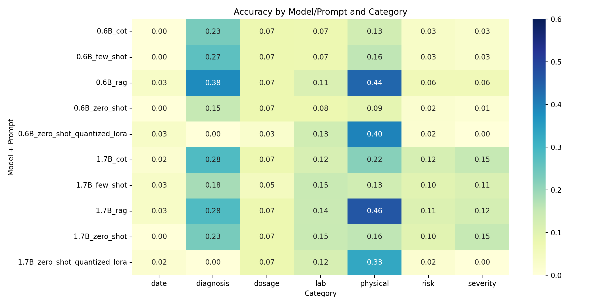

## Clinical Reasoning Model Benchmarking and Fine-Tuning (MedCalc-Bench)

This repository benchmarks and fine-tunes Qwen3 models on MedCalc-Bench clinical calculation tasks. It covers prompt engineering (zero-shot, few-shot, CoT), optional advanced methods, parameter-efficient fine-tuning (LoRA/QLoRA), and category-wise evaluation.

### Key Artifacts
- `Clinical_Reasoning_Benchmarks.ipynb`: Main, end-to-end notebook (setup → inference → evaluation).
- `outputs/`: CSV outputs from batch inference for all model/prompt combinations.
- `pivot_results.csv`: Pivoted accuracy by category for each Model+Prompt.
- `overall_results.csv`: Overall accuracy summary.
- `aggregated_results.csv`: Row-wise predictions with parsed answers and in-range flags.
- `summary_statistics.csv`: Descriptive stats used in the write-up.
- `qwen_lora_*/`: LoRA/QLoRA adapters and checkpoints (if you fine-tune).

### Environment Setup
- Python 3.10+ recommended
- NVIDIA GPU suggested (T4/A10/RTX) for fast inference; CPU is supported but slow

Quick setup via the notebook (Colab/local):
```bash
pip install --upgrade pip
pip install "transformers>=4.43.0" accelerate peft bitsandbytes datasets evaluate scikit-learn seaborn matplotlib pandas numpy einops xformers
```
If you encounter CUDA/driver issues with `bitsandbytes`, you can skip it and load models in full precision at a memory cost.

### Running the Notebook (Colab or Local)

**Recommended: Google Colab (T4 GPU, Free Tier or Pro)**

1. Open `Clinical_Reasoning_Benchmarks.ipynb` in Google Colab (right-click in GitHub or upload to Colab).
2. Run the first cell to install necessary dependencies
3. Run the data loading cell (dataset is pulled from the Hugging Face Hub).
4. Run the model loading cell and optionally the quick sanity generation cell.
5. Run the batched inference cell to generate outputs for:
   - Models: Qwen3-0.6B, Qwen3-1.7B
   - Prompts: zero-shot, few-shot, CoT (and optional RAG variants if you enable them)
6. Run the aggregation cell to compute accuracy, produce pivot tables, and write artifacts to `outputs/` and the project root.
7. Run the visualization cell to generate and save PNGs for barplots, heatmaps, and radar charts.

**Colab/VRAM Tips:**
- If you encounter out-of-memory (OOM) errors, reduce `BATCH_SIZE` in the notebook (e.g., set `BATCH_SIZE = 2` or even `1`).
- You can also reduce `N_FEW_SHOT` to fit more easily in memory.
- T4 GPUs (Colab Free) can run both models, but 1.7B may require smaller batch sizes.
- If you want to rerun a combination, delete the corresponding CSVs in `outputs/`.

**Outputs:**
- CSVs will appear under `outputs/`.
- Summary CSVs (`pivot_results.csv`, `overall_results.csv`, etc.) will be written at the repo root unless you change the paths.

**Local Run:**
- All steps are also runnable locally with a suitable GPU and Python 3.10+ environment.
- For best results, use a recent NVIDIA GPU (T4/A10/RTX). CPU is supported but much slower.

### Results Visualization

Below are visualizations generated from the evaluation CSVs. These provide a quick overview of model and prompt performance:

#### Overall Accuracy by Model and Prompt


#### Per-Category Accuracy Heatmap


#### Radar Charts by Model
Each radar chart shows per-category accuracy for all prompt types within a model.

**Qwen3-0.6B:**


**Qwen3-1.7B:**


#### Final Results Table
A compact preview of `pivot_results.csv` included here for quick inspection (values are accuracies in [0,1]):

| Model_Prompt | Overall | date | diagnosis | dosage | lab | physical | risk | severity |
|---|---:|---:|---:|---:|---:|---:|---:|---:|
| 0.6B_cot | 0.0813 | 0.0000 | 0.2333 | 0.0750 | 0.0734 | 0.1292 | 0.0333 | 0.0250 |
| 0.6B_few_shot | 0.0902 | 0.0000 | 0.2667 | 0.0750 | 0.0734 | 0.1583 | 0.0333 | 0.0250 |
| 0.6B_rag | 0.1668 | 0.0333 | 0.3833 | 0.0750 | 0.1131 | 0.4375 | 0.0625 | 0.0625 |
| 0.6B_zero_shot | 0.0609 | 0.0000 | 0.1500 | 0.0750 | 0.0765 | 0.0917 | 0.0208 | 0.0125 |
| 0.6B_zero_shot_quantized_lora | 0.0860 | 0.0333 | 0.0000 | 0.0250 | 0.1315 | 0.3958 | 0.0167 | 0.0000 |
| 1.7B_cot | 0.1403 | 0.0167 | 0.2833 | 0.0750 | 0.1193 | 0.2167 | 0.1208 | 0.1500 |
| 1.7B_few_shot | 0.1085 | 0.0333 | 0.1833 | 0.0500 | 0.1468 | 0.1333 | 0.1000 | 0.1125 |
| 1.7B_rag | 0.1759 | 0.0333 | 0.2833 | 0.0750 | 0.1437 | 0.4625 | 0.1083 | 0.1250 |
| 1.7B_zero_shot | 0.1234 | 0.0000 | 0.2333 | 0.0750 | 0.1468 | 0.1583 | 0.1000 | 0.1500 |
| 1.7B_zero_shot_quantized_lora | 0.0795 | 0.0167 | 0.0000 | 0.0750 | 0.1193 | 0.3292 | 0.0167 | 0.0000 |

#### CSV Results
- [`pivot_results.csv`](pivot_results.csv): Category-wise accuracy by Model+Prompt
- [`overall_results.csv`](overall_results.csv): Overall accuracy summary
- [`aggregated_results.csv`](aggregated_results.csv): Row-wise predictions with parsed answers and in-range flags
- [`summary_statistics.csv`](summary_statistics.csv): Descriptive stats used in the write-up

For custom analysis or plotting, you can load these CSVs in Python or your preferred tool.

### Citation
Qwen3 Models
Yang, A., Liu, Y., Guo, Z., et al. “Qwen3: Technical Report.” arXiv preprint arXiv:2505.09388, 2025.
Cite as:
Yang, A., Liu, Y., Guo, Z., et al. Qwen3: Technical Report. arXiv:2505.09388 [cs.CL], 2025.

MedCalc-Bench Dataset
Khandekar, N., Jin, Q., Xiong, G., Dunn, S., Applebaum, S., et al. “MedCalc-Bench: Evaluating Large Language Models for Medical Calculations.” arXiv preprint arXiv:2406.12036, 2024.
Cite as:
Khandekar, N., Jin, Q., Xiong, G., et al. MedCalc-Bench: Evaluating Large Language Models for Medical Calculations. arXiv:2406.12036 [cs.CL], 2024.
